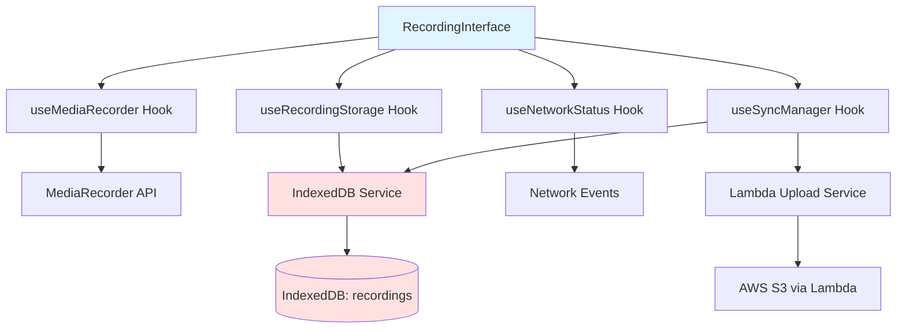
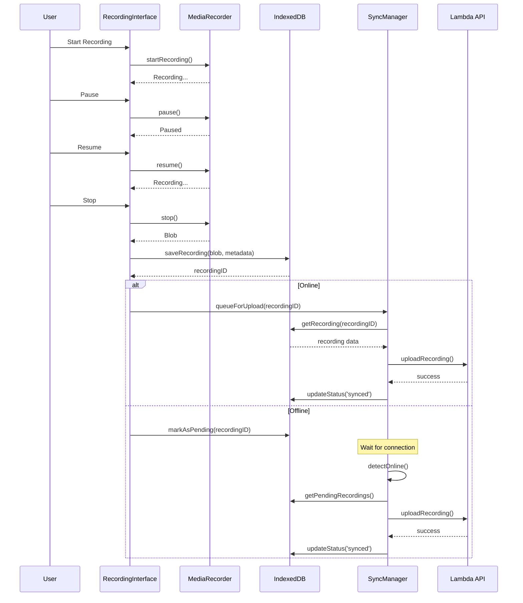

# Design Document: Offline Recording Improvements

## Overview

Este diseño implementa un sistema robusto de grabación de audio con soporte offline-first, utilizando MediaRecorder API nativa, IndexedDB para persistencia local, y un sistema de sincronización inteligente. La arquitectura se basa en el patrón de "Progressive Web App" con capacidades offline completas.

### Key Design Decisions

1. **Reemplazo de react-media-recorder**: Implementaremos un hook personalizado usando MediaRecorder API directamente para control total sobre pausa/reanudación
2. **IndexedDB como fuente de verdad local**: Todas las grabaciones se almacenan primero localmente antes de intentar subir
3. **Service Worker para detección de conectividad**: Monitoreo confiable del estado de red
4. **Queue-based sync**: Sistema de cola con reintentos y backoff exponencial
5. **Optimistic UI**: La interfaz responde inmediatamente, sincronización en background

## Architecture

### High-Level Component Diagram



### Data Flow



## Components and Interfaces

### 1. Custom MediaRecorder Hook (`useMediaRecorder`)

**Purpose**: Reemplaza `react-media-recorder` con implementación nativa que soporta pausa/reanudación correctamente.

**Interface**:
```typescript
interface UseMediaRecorderReturn {
  status: 'idle' | 'recording' | 'paused' | 'stopped' | 'error';
  startRecording: () => Promise<void>;
  pauseRecording: () => void;
  resumeRecording: () => void;
  stopRecording: () => Promise<Blob>;
  duration: number;
  error: Error | null;
  isSupported: boolean;
}

interface UseMediaRecorderOptions {
  mimeType?: string;
  audioBitsPerSecond?: number;
  onDataAvailable?: (blob: Blob) => void;
  onError?: (error: Error) => void;
}
```

**Implementation Details**:
- Usa `MediaRecorder` API nativa con `audio/webm;codecs=opus` como formato preferido
- Acumula chunks en array durante pausas para generar blob único al final
- Maneja permisos de micrófono con mensajes de error claros
- Timer interno usando `requestAnimationFrame` para precisión
- Cleanup automático de streams en unmount

### 2. IndexedDB Service (`recordingStorageService`)

**Purpose**: Abstrae operaciones de IndexedDB para almacenamiento de grabaciones y metadatos.

**Schema**:
```typescript
interface RecordingRecord {
  id: string; // UUID v4
  doctorID: string;
  blob: Blob;
  fileName: string;
  mimeType: string;
  duration: number; // seconds
  size: number; // bytes
  status: 'pending_upload' | 'uploading' | 'synced' | 'failed' | 'partial';
  syncAttempts: number;
  lastSyncAttempt: string | null;
  errorMessage: string | null;
  createdAt: string; // ISO 8601
  updatedAt: string; // ISO 8601
  syncedAt: string | null; // ISO 8601
  historyID: string | null; // Set after successful upload
  metadata: {
    patientID?: string;
    sessionNotes?: string;
  };
}

interface StorageStats {
  totalRecordings: number;
  pendingCount: number;
  syncedCount: number;
  failedCount: number;
  totalSize: number; // bytes
  availableSpace: number; // bytes (estimate)
}
```

**API**:
```typescript
class RecordingStorageService {
  async saveRecording(data: Omit<RecordingRecord, 'id' | 'createdAt' | 'updatedAt'>): Promise<string>;
  async getRecording(id: string): Promise<RecordingRecord | null>;
  async getAllRecordings(): Promise<RecordingRecord[]>;
  async getPendingRecordings(): Promise<RecordingRecord[]>;
  async updateRecordingStatus(id: string, status: RecordingRecord['status'], updates?: Partial<RecordingRecord>): Promise<void>;
  async deleteRecording(id: string): Promise<void>;
  async getStorageStats(): Promise<StorageStats>;
  async cleanupSyncedRecordings(olderThanDays: number): Promise<number>;
  async estimateQuota(): Promise<{ usage: number; quota: number }>;
}
```

**Implementation Details**:
- Database name: `clinicalops-recordings`
- Object store: `recordings` con índices en `status`, `doctorID`, `createdAt`
- Usa transacciones para operaciones atómicas
- Implementa retry logic para operaciones fallidas
- Maneja quota exceeded errors gracefully

### 3. Network Status Hook (`useNetworkStatus`)

**Purpose**: Monitorea estado de conectividad de manera confiable.

**Interface**:
```typescript
interface UseNetworkStatusReturn {
  isOnline: boolean;
  isSlowConnection: boolean;
  connectionType: 'wifi' | '4g' | '3g' | '2g' | 'unknown';
  effectiveType: 'slow-2g' | '2g' | '3g' | '4g';
}
```

**Implementation Details**:
- Escucha eventos `online`/`offline` del navegador
- Usa Network Information API cuando disponible
- Verifica conectividad real haciendo ping a endpoint de health check
- Debounce de cambios de estado para evitar flapping
- Persiste último estado conocido en localStorage

### 4. Sync Manager Hook (`useSyncManager`)

**Purpose**: Gestiona sincronización automática y manual de grabaciones pendientes.

**Interface**:
```typescript
interface UseSyncManagerReturn {
  isSyncing: boolean;
  syncProgress: {
    current: number;
    total: number;
    currentRecordingProgress: number;
  };
  pendingCount: number;
  failedCount: number;
  syncAll: () => Promise<void>;
  syncRecording: (id: string) => Promise<void>;
  cancelSync: () => void;
  retryFailed: () => Promise<void>;
}

interface SyncManagerOptions {
  autoSync: boolean;
  maxConcurrent: number;
  retryAttempts: number;
  retryDelay: number; // ms
}
```

**Implementation Details**:
- Queue basada en prioridad (más antiguas primero)
- Backoff exponencial: 1s, 2s, 4s para reintentos
- Máximo 2 uploads concurrentes para no saturar conexión
- Cancela uploads en progreso si se pierde conexión
- Emite eventos para actualizar UI en tiempo real
- Usa AbortController para cancelación limpia

### 5. Recording Management Interface (`RecordingManagementPanel`)

**Purpose**: UI para gestionar grabaciones locales, ver estado y tomar acciones.

**Features**:
- Lista de grabaciones con filtros (pending, synced, failed)
- Reproducción de audio inline
- Indicadores de tamaño y duración
- Acciones: subir, eliminar, reintentar
- Estadísticas de almacenamiento
- Botón de limpieza de grabaciones antiguas

**Component Structure**:
```typescript
<RecordingManagementPanel>
  <StorageStats />
  <RecordingFilters />
  <RecordingList>
    <RecordingCard
      recording={recording}
      onPlay={handlePlay}
      onUpload={handleUpload}
      onDelete={handleDelete}
      onRetry={handleRetry}
    />
  </RecordingList>
  <CleanupDialog />
</RecordingManagementPanel>
```

### 6. Enhanced Recording Interface (`RecordingInterface`)

**Purpose**: Componente principal mejorado con soporte offline y mejor UX.

**New Features**:
- Indicador de estado de conexión prominente
- Contador de grabaciones pendientes
- Notificaciones de sincronización automática
- Mejor feedback visual durante pausas
- Confirmación antes de salir con grabación en progreso
- Link rápido a panel de gestión

## Data Models

### IndexedDB Schema

```typescript
// Database: clinicalops-recordings, Version: 1

interface IDBSchema {
  recordings: {
    key: string; // id
    value: RecordingRecord;
    indexes: {
      'by-status': string; // status
      'by-doctor': string; // doctorID
      'by-created': string; // createdAt
      'by-synced': string; // syncedAt
    };
  };
}
```

### Local Storage Keys

```typescript
const STORAGE_KEYS = {
  LAST_NETWORK_STATUS: 'clinicalops:network:last-status',
  SYNC_PREFERENCES: 'clinicalops:sync:preferences',
  CLEANUP_POLICY: 'clinicalops:cleanup:policy',
} as const;
```

## Error Handling

### Error Categories

1. **Permission Errors**
   - Micrófono no autorizado
   - Mensaje: "Necesitamos acceso al micrófono. Por favor, permite el acceso en la configuración de tu navegador."
   - Acción: Mostrar instrucciones específicas por navegador

2. **Storage Errors**
   - Quota exceeded
   - Mensaje: "Almacenamiento lleno. Elimina grabaciones antiguas sincronizadas para liberar espacio."
   - Acción: Abrir panel de gestión con sugerencias de limpieza

3. **Network Errors**
   - Upload failed
   - Mensaje: "No se pudo subir la grabación. Se reintentará automáticamente cuando haya conexión."
   - Acción: Marcar como pending, agregar a cola de reintentos

4. **Recording Errors**
   - MediaRecorder error
   - Mensaje: "Error durante la grabación. Los datos parciales se han guardado."
   - Acción: Guardar blob parcial con estado 'partial', permitir reintentar

### Error Recovery Strategy

```typescript
interface ErrorRecoveryStrategy {
  type: 'retry' | 'fallback' | 'notify' | 'ignore';
  maxAttempts?: number;
  backoffMs?: number;
  fallbackAction?: () => void;
  userNotification?: string;
}

const ERROR_STRATEGIES: Record<string, ErrorRecoveryStrategy> = {
  NETWORK_ERROR: {
    type: 'retry',
    maxAttempts: 3,
    backoffMs: 1000,
    userNotification: 'Reintentando subida...',
  },
  QUOTA_EXCEEDED: {
    type: 'notify',
    userNotification: 'Almacenamiento lleno. Limpia grabaciones antiguas.',
    fallbackAction: () => openCleanupDialog(),
  },
  PERMISSION_DENIED: {
    type: 'notify',
    userNotification: 'Acceso al micrófono denegado.',
    fallbackAction: () => showPermissionInstructions(),
  },
  RECORDING_ERROR: {
    type: 'fallback',
    userNotification: 'Error en grabación. Guardando datos parciales.',
    fallbackAction: () => savePartialRecording(),
  },
};
```

## Testing Strategy

### Unit Tests

1. **useMediaRecorder Hook**
   - Test pause/resume mantiene continuidad
   - Test cleanup de streams
   - Test manejo de permisos
   - Mock MediaRecorder API

2. **RecordingStorageService**
   - Test CRUD operations
   - Test índices y queries
   - Test cleanup de registros antiguos
   - Test manejo de quota exceeded
   - Mock IndexedDB usando fake-indexeddb

3. **useSyncManager Hook**
   - Test queue ordering
   - Test retry logic con backoff
   - Test cancelación de uploads
   - Test manejo de errores de red
   - Mock fetch y Lambda API

### Integration Tests

1. **Recording Flow Completo**
   - Grabar → Pausar → Reanudar → Detener → Guardar
   - Verificar blob final es continuo
   - Verificar metadatos correctos en IndexedDB

2. **Offline → Online Flow**
   - Grabar offline
   - Verificar almacenamiento local
   - Simular reconexión
   - Verificar sincronización automática
   - Verificar actualización de estado

3. **Error Recovery**
   - Simular quota exceeded durante grabación
   - Simular pérdida de conexión durante upload
   - Verificar reintentos automáticos
   - Verificar mensajes de error apropiados

### Manual Testing Checklist

- [ ] Grabar con múltiples pausas y verificar audio continuo
- [ ] Desconectar internet y grabar, verificar almacenamiento local
- [ ] Reconectar y verificar sincronización automática
- [ ] Llenar almacenamiento y verificar manejo de quota
- [ ] Cerrar navegador con grabación pendiente y verificar persistencia
- [ ] Probar en diferentes navegadores (Chrome, Firefox, Safari, Edge)
- [ ] Probar en móvil (iOS Safari, Android Chrome)
- [ ] Verificar limpieza automática de grabaciones antiguas

## Performance Considerations

### Optimizations

1. **Lazy Loading**
   - RecordingManagementPanel se carga solo cuando se accede
   - Audio player se carga on-demand

2. **Chunked Uploads**
   - Archivos >10MB se suben en chunks de 5MB
   - Permite reanudar uploads interrumpidos

3. **IndexedDB Indexing**
   - Índices en campos frecuentemente consultados
   - Queries optimizadas con cursores

4. **Memory Management**
   - Liberar blobs después de upload exitoso
   - Revocar object URLs después de uso
   - Limitar recordings en memoria (paginación)

### Monitoring

```typescript
interface PerformanceMetrics {
  recordingStartTime: number;
  recordingDuration: number;
  saveToIndexedDBTime: number;
  uploadStartTime: number;
  uploadDuration: number;
  uploadSpeed: number; // bytes/sec
  retryCount: number;
}
```

## Security Considerations

1. **Data Privacy**
   - Grabaciones nunca se envían a servicios de terceros
   - IndexedDB es origin-specific (no cross-site access)
   - Blobs se limpian de memoria después de uso

2. **Authentication**
   - doctorID se valida antes de guardar
   - Tokens de auth se incluyen en uploads
   - Verificación de permisos en Lambda

3. **Content Security**
   - Validación de MIME types
   - Límite de tamaño de archivo (500MB)
   - Sanitización de nombres de archivo

## Migration Strategy

### Phase 1: Implement Core Infrastructure
- Crear useMediaRecorder hook
- Implementar RecordingStorageService
- Setup IndexedDB schema

### Phase 2: Integrate with Existing Component
- Reemplazar react-media-recorder en RecordingInterface
- Agregar almacenamiento local después de cada grabación
- Mantener flujo de upload existente

### Phase 3: Add Offline Support
- Implementar useNetworkStatus
- Agregar detección de offline
- Implementar queue de pending uploads

### Phase 4: Add Sync Manager
- Implementar useSyncManager
- Agregar sincronización automática
- Implementar retry logic

### Phase 5: Add Management UI
- Crear RecordingManagementPanel
- Agregar link desde dashboard
- Implementar cleanup automático

### Phase 6: Polish & Testing
- Agregar notificaciones
- Mejorar mensajes de error
- Testing exhaustivo
- Documentación de usuario

## Dependencies

### New Dependencies
```json
{
  "idb": "^8.0.0",
  "uuid": "^9.0.1"
}
```

### Browser APIs Required
- MediaRecorder API (Chrome 47+, Firefox 25+, Safari 14.1+)
- IndexedDB (Universal support)
- Network Information API (Optional, progressive enhancement)
- Storage API (Optional, for quota estimation)

## Rollback Plan

Si hay problemas críticos después del deploy:

1. **Feature Flag**: Agregar flag `ENABLE_OFFLINE_RECORDING` en env vars
2. **Fallback**: Si flag es false, usar implementación anterior con react-media-recorder
3. **Data Migration**: Grabaciones en IndexedDB permanecen accesibles, se pueden exportar manualmente
4. **Monitoring**: Logs de errores en Sentry para identificar issues rápidamente
